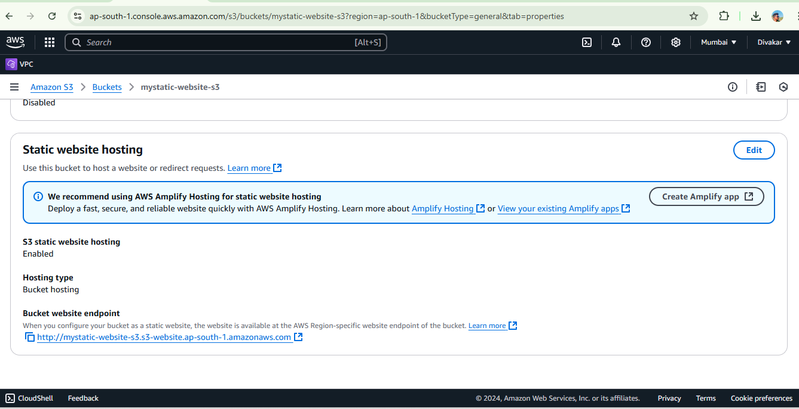

# Hosted a Static Website on Amazon S3
---
## Steps to do 
### **Step 1: Create an S3 Bucket**
1. Log in to your [AWS Management Console](https://aws.amazon.com/console/).
2. Search for **S3** in the search bar and open the S3 service.
3. Click on **"Create bucket"**.

<br> Created bucket successfully.<br>
4. Enter a unique bucket name (e.g., `my-static-website`) and choose a region.
5. **Uncheck** the option **"Block all public access"**, as we need the website to be accessible publicly.
6. Acknowledge the warning by ticking the checkbox, and click **"Create bucket"**.

---

### **Step 2: Upload Website Files**
1. Open the bucket you just created.
2. Go to the **"Objects"** tab and click on **"Upload"**.
3. Add all your website files (e.g., `index.html`, `style.css`, etc.).
4. Click **"Upload"** to upload your files to the S3 bucket.

<br>
Uploaded objects in the bucket<br>
---

### **Step 3: Enable Static Website Hosting**
1. Go to the **"Properties"** tab in your S3 bucket.
2. Scroll down to **"Static website hosting"** and click **"Edit"**.
3. Select **"Enable"** under static website hosting.
4. Provide the **index document** (e.g., `index.html`) and, optionally, an **error document** (e.g., `error.html`).
5. Click **"Save changes"**.

<br>

---

### **Step 4: Make Your Bucket Public**
1. Go to the **"Permissions"** tab in your S3 bucket.
2. Scroll to **"Bucket policy"** and click **"Edit"**.
3. Add the following bucket policy to allow public access:
   ```json
   {
     "Version": "2012-10-17",
     "Statement": [
       {
         "Effect": "Allow",
         "Principal": "*",
         "Action": "s3:GetObject",
         "Resource": "arn:aws:s3:::<your-bucket-name>/*"
       }
     ]
   }
## Step 5: Access Your Website

1. Navigate to the **"Properties"** tab of your S3 bucket in the AWS Management Console.
2. Scroll down to the **"Static website hosting"** section.
3. Copy the **Bucket Endpoint URL** provided. It will look like this:<br>
<br>
4. Open your browser and paste the copied URL into the address bar.
5. Your website is now live!
<br>RESULT<br>


